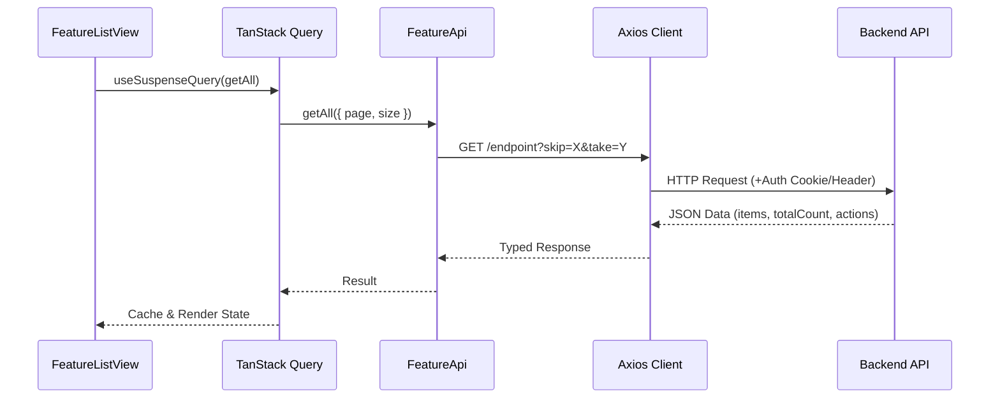
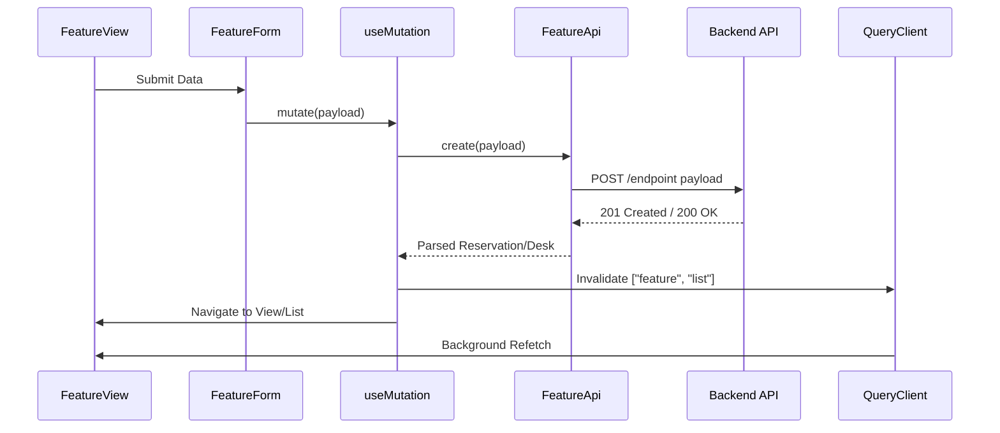

# Hoteling System - Web Client

This repository contains the modern, type-safe frontend implementation of the Hoteling System, built with React and TypeScript.

## Technologies

- **React 19** - The library for web and native user interfaces.
- **TypeScript** - Strongly typed programming language for better developer experience.
- **Vite** - Next-generation frontend tooling for fast builds and HMR.
- **TanStack Query (v5)** - Powerful asynchronous state management for TS/JS.
- **TanStack Router** - Fully type-safe router for React.
- **Axios** - Promise-based HTTP client with request/response interceptors.
- **Material UI (MUI) v7** - Comprehensive suite of UI tools to implement design systems.
- **React Hook Form & Zod** - Performant form management and schema-based validation.
- **i18next** - Internationalization framework.
- **Zustand** - Light, fast, and scalable bearbones state-management.

## Installation and Configuration

### Prerequisites
- [Node.js](https://nodejs.org/) (v18 or higher)
- [npm](https://www.npmjs.com/) (usually comes with Node.js)

### Setup
1. Clone the repository and navigate to the project directory:
   ```bash
   cd hoteling-web
   ```
2. Install dependencies:
   ```bash
   npm install
   ```
3. Create a `.env` file in the root directory (copy from existing configuration or create new):
   ```env
   VITE_API_URL=http://localhost:5126/api
   ```

## Running the Project

Start the development server:
```bash
npm run dev
```
The application will be available at: `http://localhost:5173`

## Project Structure

The project follows a feature-based modular architecture:

- `src/app` - Application core setup (Query Client, Router, Theme, Contexts).
- `src/features` - Encapsulated business logic by domain:
  - `auth` - Authentication logic, store, and views.
  - `desks` - Desk management and list views.
  - `reservations` - Reservation workflows.
- `src/shared` - Reusable architecture and components:
  - `api` - Axios instance and interceptors for auth headers.
  - `components` - Shared UI elements (buttons, loaders, etc.).
  - `lib/crud` - Generic logic to generate CRUD modules and queries.
- `src/routes` - Type-safe route definitions.
- `src/locales` - Multi-language support (EN, PL).

## Data Flow

The application uses a centralized CRUD logic that connects UI components to the API layer via TanStack Query.

### 1. Fetching Data (Get All / List)
Used in `DesksListView` and `ReservationsListView`.



### 2. Mutating Data (Create / CreateAsync)
Used in `DeskCreateView` and `ReservationCreateView`.



## Authentication

Authentication is handled via Google OAuth 2.0.
1. The user is redirected to the backend login endpoint.
2. After successful authentication, a secure cookie is established.
3. The `interceptors.ts` in the shared API layer ensures all requests are authenticated.
4. If the session expires (401), the app automatically handles logout and redirects to the login page.
